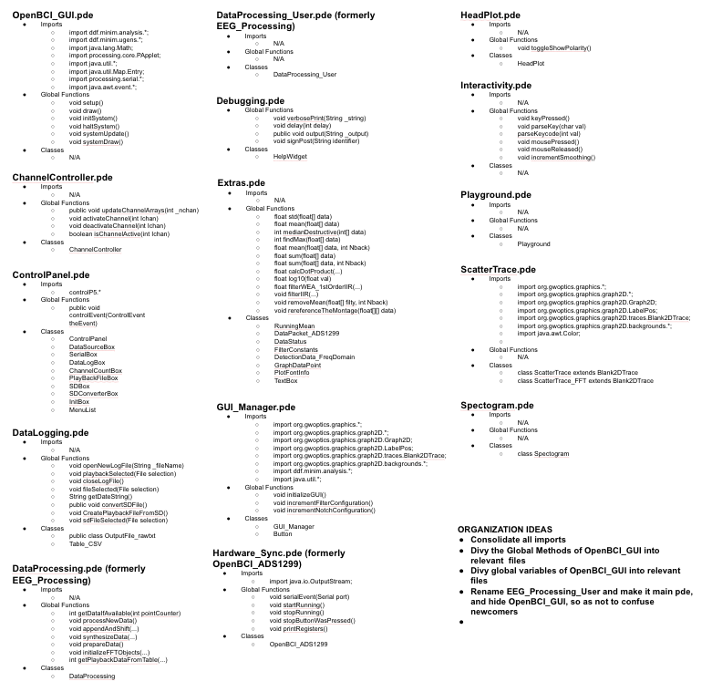

# OpenBCI_GUI_v2.0
Based on OpenBCI_Processing, OpenBCI_GUI_v2.0 extends the GUI to include additional features, and will soon be usable with the Ganglion board.

Link to: [Code Map](https://docs.google.com/drawings/d/1nx1ecQ31996_2SEsDDrqZKPqpt3ZzY15zS1yn3Pr8ho/edit?usp=sharing)

*
[Google Drawings Code Map Link](https://docs.google.com/drawings/d/1nx1ecQ31996_2SEsDDrqZKPqpt3ZzY15zS1yn3Pr8ho/edit?usp=sharing)*