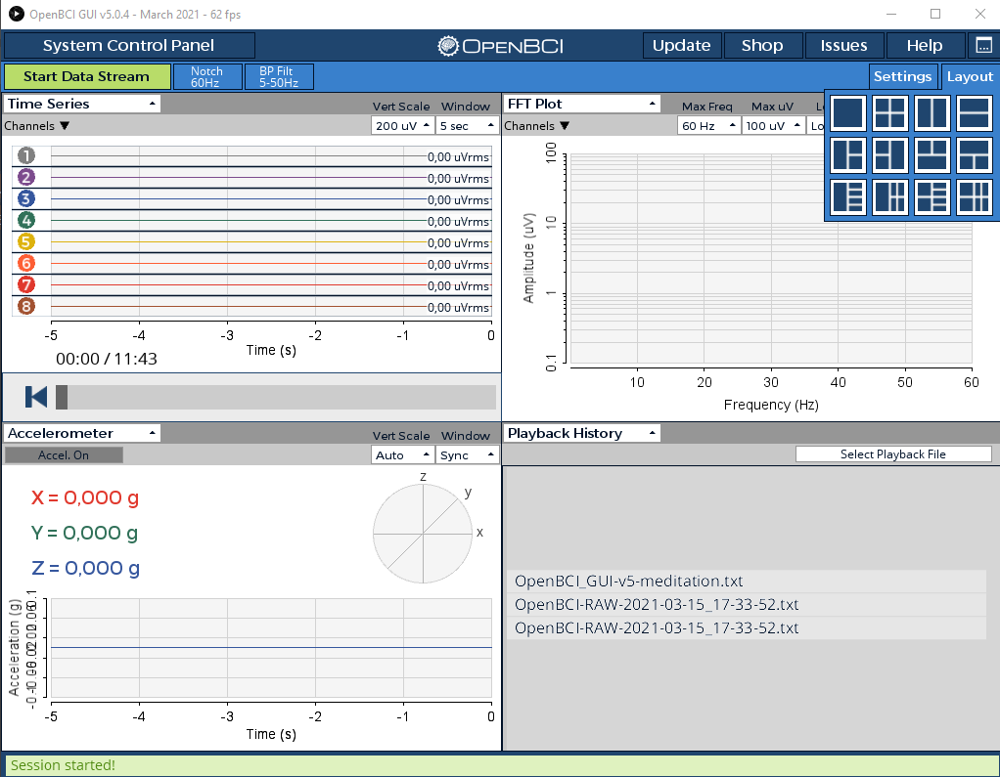
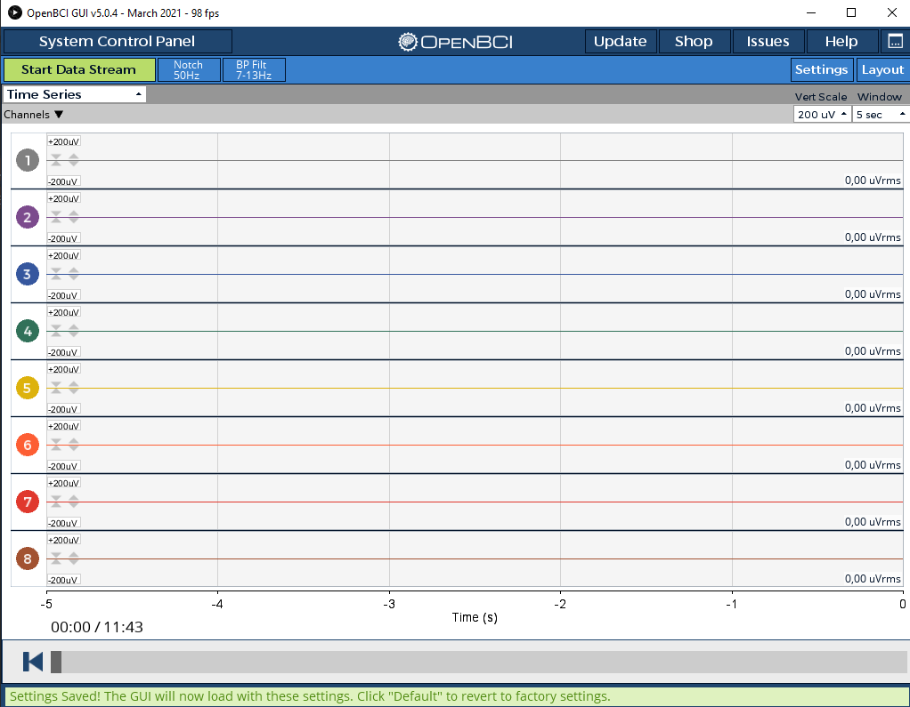

# Enhancement (bug?) in default settings  
## What's wrong : 
Several options ( *Current Layout, Notch, Bandpass Filter, widget in Ui, etc.* ) in the xxxxDefaultSettings.json are not applied by the app.  
## Motivation 
Start the app directly in a known config to recover directly the set conditions of our main usage.   
## Analysis :   
At the beginning of OpenBCI_GUI after `InitSystem -- Init 4 --`   
the defaults parameters set in app at startup are written to disk by a  *```settings.init();```* that overwrite previously saved xxxdefaultSettings.json.    
 
## Solution
App must re-read first the default settings if it exists.       
# patch
### In SessionSettings.pde create a new method tryToloadEarlySettings
``` java
/*
 load  parameters from default settings to keep track of saved UI options 
*/
void tryToloadEarlySettings()  {
    String loadGUISettingsFileLocation = this.getPath("Default", eegDataSource, nchan);
    try {
        this.load(loadGUISettingsFileLocation);
    }catch (Exception e) {
         verbosePrint("** Unable to load initial settings of "+loadGUISettingsFileLocation+'\n'+e);
    }
}
```

### in OpenBCI_GUI.PDE add a new call before saving initial settings
 
  ``` java
  verbosePrint("OpenBCI_GUI: initSystem: -- Init 4 -- " + millis());
 
    //don't save default session settings for Galea or StreamingBoard
    if (eegDataSource != DATASOURCE_GALEA && eegDataSource != DATASOURCE_STREAMING) {
        // if exists, take care of saved parameters 
        settings.tryToloadEarlySettings();
        //Init software settings: create default settings file that is datasource unique
        settings.init();
        settings.initCheckPointFive();
    } else if ... 
```   

 ### TopNav.pde Found a minor pbs bug(?) on layout while testing this patch 
  In TopNav in `public void controlEvent(CallbackEvent theEvent)`    
  the index of current layout is increased by 1 in by `wm.setNewContainerLayout(layoutNumber+1);`( and also in message to show info in lower bar)   
  This gives a shift in saved settings as the code to reload settings uses a direct ```(layoutNumber)``` and not a ``(layoutNumber-1)``.  
  I don't know why one would store 1 when index is 0 for layout ?   
  ( for others parameters the config file uses direct index starting at 0 ).   
  => these two "~~+1~~" were removed and everything is ok. 

## A remaining questions 
Do we have to do that for **all** DataSources including GALEA and STREAMING as this patch is inside     
``` java 
if (eegDataSource != DATASOURCE_GALEA && eegDataSource != DATASOURCE_STREAMING) {
  ```   


# How to test 
## Default 
( Here the test is done for mode *Playback* ).
1. Delete the default file of playback to be sure to start from scratch :    
* xxx\OpenBCI_GUI\Settings\PlaybackDefaultSettings.json*
2. Start app, choose Playback (and a playback file) 
3. Start session :   
  if you are in verbose debug (isVerbose=true), you will find in the log the fact that the initial load fails as no file :    
```** Unable to load initial settings of ...\Settings\PlaybackDefaultSettings.json```
4. Once session started you can find a new fresh file *PlaybackDefaultSettings.json* set by app 
with inside: 
```json
   "settings": {
    "Current Layout": 1,
    "Expert Mode": false,
    "Notch": 0,
    "Bandpass Filter": 0,
    "Analog Read Vert Scale": 5,
    "Analog Read Horiz Scale": 0
  },
    "widget": {
    "Widget_0": 1,
    "Widget_1": 3,
    "Widget_2": 7,
    "Widget_3": 9
  },
  ```
 Which are the default for OpenBCI_GUI: 
 Notch: 0 => 60hz
 BandPass Filter: 0 => 5-50hz
 etc. 
 Layout index 1 => screen splitted in 4 parts
 with _0:TimeSeries, _1:FFT, _2:Accelerometer,_3 playback History   



## settings startup default conditions as needed

  1. Change options in GUI :   
     i set Layout to the first option:  full screen window
     i leave TimeSeries in this window  
     i set Notch to 50Hz (i am in Europe)   
     i set BP_filter to 7-13hz   

  2. Save settings with the settings button :   
     This open a window with *Save a **custom** settings file as json* 
     Change the destination as we want these options to be default :    
     Dont write on ~~```Playback**User**Settings.json```~~ ,   
    but on ```Playback**Default**Settings.json```    
    ( accept replace )   

  3. you can have a look in the json file : 
    ```json
      "settings": {
    "Current Layout": 0,
    "Expert Mode": false,
    "Notch": 1,
    "Bandpass Filter": 1,
    "Analog Read Vert Scale": 5,
    "Analog Read Horiz Scale": 0
  },
    "widget": {"Widget_0": 5},
    ```   

  4. Stop and restart app    
  now, the app starts as we need:       
  .In full screen (layout #0) with Time series   
  .With a notch of 50hz (#1)   
  .And a BP Filter 7-13 (#1)   
  etc.   

